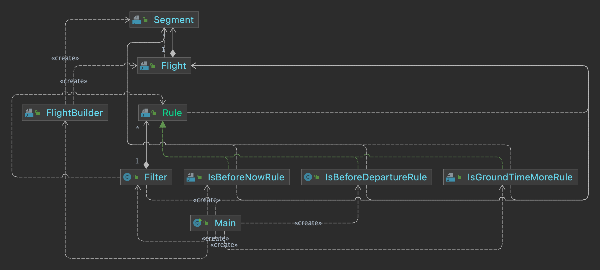

# gridnine_krasov

This project represents my solutions for Gridnine Systems company test tasks.

Task:

There is a certain system that processes air travel.

A flight is the transportation of a passenger from one point to another with possible intermediate landings. In this way, a flight can be represented as a set of one or more elementary movements, called segments.

A segment is an atomic shipment that is characterized by two attributes: departure date/time and arrival date/time.

You need to write a small module that will filter a set of flights according to different rules.

There can be a lot of filtering rules. Also sets of flights can be very large. Rules can be selected and set dynamically depending on the context of the filtering operation.

Think over the structure of the module, create the necessary classes and interfaces.

If you are familiar with `Junit`, then cover your code with tests.

Do not consider the user interface. It is enough to output information to the console. You don't need to use any third party libraries.

All code must be placed in the `com.gridnine.testing` package

For a test run, create a public `Main` class with a `main()` method. Place the following test code in `main()`:
Exclude flights from the test set according to the following rules (each rule requires a separate output of the list of flights):

1. departure date is earlier than the current time
2. there are segments with an arrival date earlier than the departure date
3. total time spent on the ground exceeds two hours (time on the ground is the interval between the arrival of one segment and the departure of the next one)

Solution

To resolve this task I created a `Rule` interface with a `test` method and an `enum` of created `Rule`'s implementation names (the task supposes three of them).

The main logic is stored in a `Filter` class that has a same named `filter` method and some other methods to add, reset and delete `Rule`'s.

Models of `Flight` and `Sigment` as well as `FlightBuilder` class were supplied by task's author.

